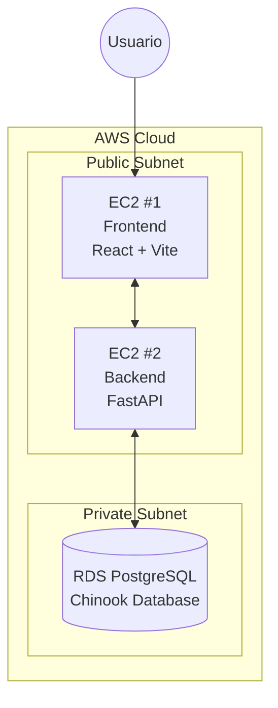

# 🎵 Chinook Music Store

Gestión y compra de canciones en línea basada en la base de datos **Chinook**, desplegada en **AWS** con un pipeline de **CI/CD automatizado**.

---

# 📖 Descripción

**Chinook Music Store** es una aplicación web **Full Stack** que permite a los usuarios:

- Explorar el catálogo musical de la base de datos Chinook
- Buscar canciones por **nombre, artista o género**
- Realizar **compras en línea**
- Gestionar **autenticación con roles (admin / usuario)**

La aplicación incluye validación de formularios, rutas protegidas y notificaciones de las operaciones realizadas por el usuario.

---

# 🏗️ Arquitectura



> **Seguridad:**  
> La base de datos **RDS** se encuentra en una **subred privada**, siendo accesible únicamente por la instancia **Backend** mediante reglas de **Security Groups**.

---

# 🛠️ Tecnologías

## Frontend

| Tecnología | Versión | Uso |
|---|---|---|
| React | 18.x | Framework UI |
| Vite | 5.x | Build tool |
| React Router DOM | 6.x | Navegación |
| Axios | 1.x | Consumo de API |
| Vitest | 2.1.9 | Pruebas unitarias |
| React Testing Library | 14.x | Testing de componentes |

---

## Backend

| Tecnología | Versión | Uso |
|---|---|---|
| Python | 3.12 | Lenguaje base |
| FastAPI | 0.x | Framework API REST |
| SQLAlchemy | 2.x | ORM |
| Pydantic | 2.x | Validación de datos |
| PyJWT / Passlib | - | Autenticación JWT |
| PyTest | 9.0.2 | Pruebas unitarias |

---

## Infraestructura

| Servicio | Uso |
|---|---|
| AWS EC2 (x2) | Hosting del Frontend y Backend |
| AWS RDS PostgreSQL | Base de datos en subred privada |
| GitHub Actions | Pipeline CI/CD |

---

# 📁 Estructura del Proyecto

```bash
Parcial_BigData_Corte1/
│
├── .github/workflows/        # Automatización CI/CD
│
├── frontend/                 # SPA en React
│   ├── src/
│   │   ├── components/       # Componentes UI reutilizables
│   │   ├── pages/            # Vistas principales
│   │   ├── services/         # Clientes de API
│   │   └── tests/            # Pruebas de componentes
│   │
│   └── vite.config.js
│
├── backend/                  # API RESTful
│   ├── app/
│   │   ├── models/           # Entidades de base de datos
│   │   ├── schemas/          # Validaciones Pydantic
│   │   ├── routers/          # Endpoints
│   │   └── tests/            # Pruebas de integración
│   │
│   └── requirements.txt
│
└── Chinook_PostgreSql.sql    # Esquema de la base de datos
```

---

# ⚙️ Funcionalidades

| Módulo | Descripción |
|---|---|
| 🔐 Auth | Registro de usuarios y login seguro con **JWT**. Manejo de roles **admin** y **usuario** |
| 🎵 Catálogo | Buscador avanzado por **Track, Artista o Género** |
| 🛒 Checkout | Proceso de compra con validación de cliente y generación de factura |
| 🎨 UX/UI | Interfaz responsiva con **notificaciones en tiempo real** y **rutas protegidas** |

---

# 🧪 Calidad de Software (Testing)

Contamos con una **suite de pruebas automatizadas** que garantizan la estabilidad del sistema en cada cambio.

| Capa | Casos de Prueba | Estado |
|---|---|---|
| Backend Endpoints | 11 | ✅ 100% Pass |
| Backend Services | 12 | ✅ 100% Pass |
| Frontend Components | 9 | ✅ 100% Pass |
| Frontend API Service | 5 | ✅ 100% Pass |
| **TOTAL** | **37** | 🚀 Ready for Production |

---

# 🚀 Pipeline CI/CD

El flujo de despliegue es **completamente automático** al realizar un `push` a la rama **main**.

## Continuous Integration (CI)

1. Instalación de dependencias (`npm install` / `pip install`)
2. Ejecución de **linters**
3. Ejecución de **pruebas unitarias**

---

## Continuous Deployment (CD)

<<<<<<< HEAD
- Ana Amador 
=======
1. Conexión vía **SSH** a las instancias **EC2**
2. Actualización del código (`git pull`)
3. Build de producción del **Frontend (React)**
4. Reinicio de servicios **FastAPI / Gunicorn**

---

# 👨‍💻 Autores

- **Alan Osorio**
- **Daniela López**
- **Ana Amador**

---
>>>>>>> e0b8d9f (correcion de readme)
